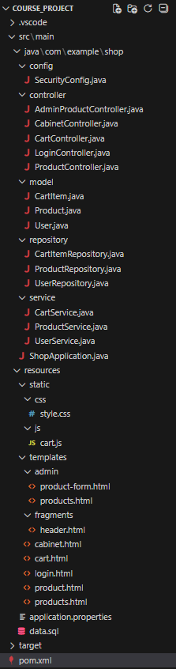
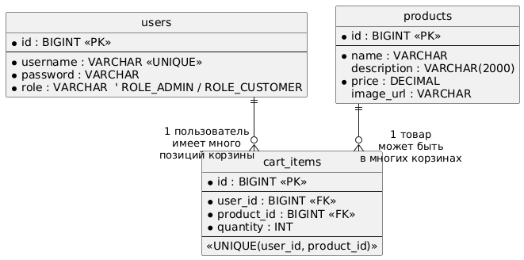
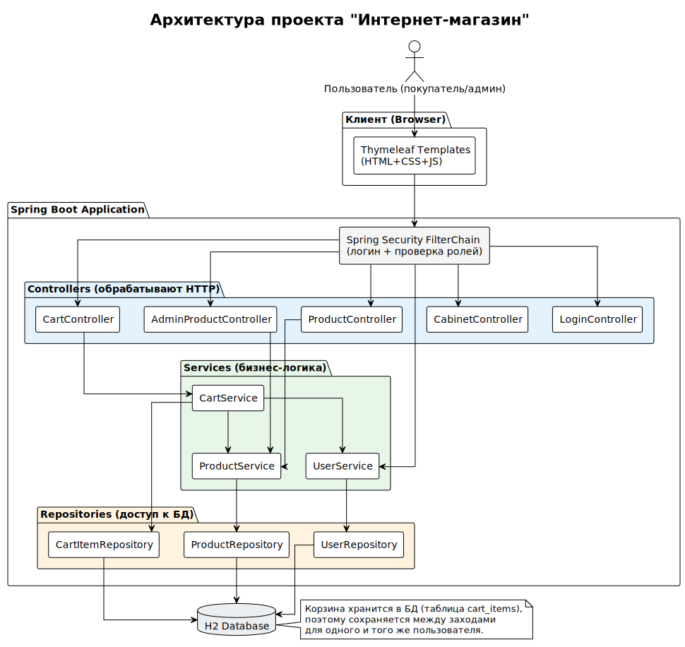

# Пояснительная записка к курсовому проекту  
## Дисциплина: «Программная инженерия»  
## Тема: Веб‑приложение «Интернет‑магазин» (Spring Boot + Thymeleaf)

## 1. Введение

Цель курсового проекта - разработать веб‑приложение интернет‑магазина с поддержкой ролей **покупатель** и **администратор**.  
Приложение реализовано на Java с использованием Spring Boot и шаблонизатора Thymeleaf. Данные хранятся в базе H2.

---

## 2. Постановка задачи

Требуется реализовать сайт интернет‑магазина со следующими возможностями:

### 2.1 Роли
- **Покупатель (ROLE_CUSTOMER)**
- **Администратор (ROLE_ADMIN)**

### 2.2 Возможности покупателя
- Доступ к:
  - странице товаров;
  - странице товара (подробная информация);
  - корзине;
  - личному кабинету.
- На странице товаров:
  - фильтрация по названию и цене;
  - добавление товара в корзину;
  - переход на страницу товара.
- **Корзина должна сохраняться между заходами** (после закрытия сайта состояние корзины не теряется для того же пользователя).

### 2.3 Возможности администратора
- CRUD по товарам:
  - создание;
  - редактирование;
  - удаление.

---

## 3. Используемые технологии

- **Java 21**
- **Spring Boot 3.5.8**
- **Spring MVC** (контроллеры, маршруты)
- **Spring Security** (аутентификация и роли)
- **Spring Data JPA / Hibernate** (работа с БД)
- **Thymeleaf** (HTML‑шаблоны)
- **H2 Database** (встроенная БД)
- **Maven** (сборка проекта)
- **CSS** и **JS** (оформление и пересчет сумм в корзине)

---

## 4. Структура проекта

Проект имеет стандартную структуру Spring Boot приложения.

---

## 5. Модель данных

### 5.1 Сущности
В проекте используются 3 основные сущности:

- **User** - пользователь (покупатель или администратор).
- **Product** - товар.
- **CartItem** - позиция корзины (товар + количество) для конкретного пользователя.

### 5.2 ER‑диаграмма

**Место для изображения ER‑диаграммы:**

Краткое описание связей:
- Один пользователь может иметь много позиций корзины (**User 1..* CartItem**).
- Один товар может встречаться в корзинах многих пользователей (**Product 1..* CartItem**).
- Для корзины введено ограничение уникальности `(user_id, product_id)`, чтобы один и тот же товар не создавался в корзине дублями, а увеличивалось количество.

---

## 6. Архитектура приложения

### 6.1 Общая схема
Приложение построено по типовой слоистой архитектуре:

- **Controller** - принимает HTTP‑запросы, возвращает страницы (Thymeleaf) и выполняет переходы.
- **Service** - содержит бизнес‑логику (поиск товаров, логика корзины).
- **Repository** - слой доступа к данным (Spring Data JPA).
- **DB (H2)** - хранение пользователей, товаров и корзины.

### 6.2 Причина выбора такой архитектуры
Такой подход:
- упрощает поддержку и чтение кода;
- разделяет ответственность по слоям;
- соответствует типовым проектам на Spring.

---

## 7. Описание функционала

### 7.1 Аутентификация и роли
Используется Spring Security:
- Страница входа: `/login`
- После входа пользователь попадает на `/products`
- Доступ к `/admin/**` разрешен только роли **ROLE_ADMIN**

### 7.2 Страницы покупателя
- `/products` - список товаров + фильтрация  
- `/products/{id}` - страница товара  
- `/cart` - корзина пользователя  
- `/cabinet` - личный кабинет  

### 7.3 Корзина (сохранение состояния)
Состояние корзины сохраняется в базе данных в таблице `cart_items`, поэтому:
- если пользователь закрывает сайт и заходит снова,
- после входа в тот же аккаунт корзина будет в том же состоянии.

### 7.4 Админка
- `/admin/products` - список товаров
- `/admin/products/new` - создание товара
- `/admin/products/{id}/edit` - редактирование
- удаление выполняется POST‑запросом `/admin/products/{id}/delete`

---

## 8. Тестовые учетные записи

В проекте в `data.sql` создаются пользователи:

- **Администратор**
  - login: `admin`
  - password: `password`
  - role: `ROLE_ADMIN`

- **Покупатель**
  - login: `user`
  - password: `password`
  - role: `ROLE_CUSTOMER`

---

## 9. Заключение

В результате выполнения курсового проекта реализовано веб‑приложение интернет‑магазина с:
- разделением ролей покупатель/администратор;
- просмотром и фильтрацией товаров;
- страницей товара;
- корзиной, сохраняющей состояние между заходами;
- CRUD товарами в админской части.

Проект реализован с использованием Spring Boot, Thymeleaf, Spring Security и H2.

## 10. Приложения

### 10.1 Ссылки на диаграммы и материалы
- Файловая структура: [docs/project_structure.png](https://github.com/Alexander8551/course_project-shop/blob/main/docs/project_structure.png?raw=true)
- ER‑диаграмма: [docs/ER_diagram.png](https://github.com/Alexander8551/course_project-shop/blob/main/docs/ER_diagram.png?raw=true)
- Архитектурная диаграмма: [docs/architect_diagram.svg](https://github.com/Alexander8551/course_project-shop/raw/refs/heads/main/docs/architect_diagram.svg)
- Видео с демонстрацией работы приложения: [demo_video.mp4](https://github.com/Alexander8551/course_project-shop/raw/refs/heads/main/demo_video.mp4)
- Архив с исходным кодом приложения: [course_project-shop.zip](https://github.com/Alexander8551/course_project-shop/raw/refs/heads/main/course_project-shop.zip)
